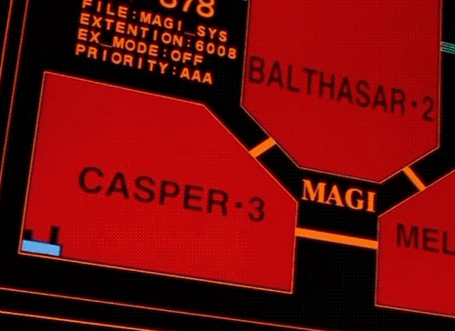
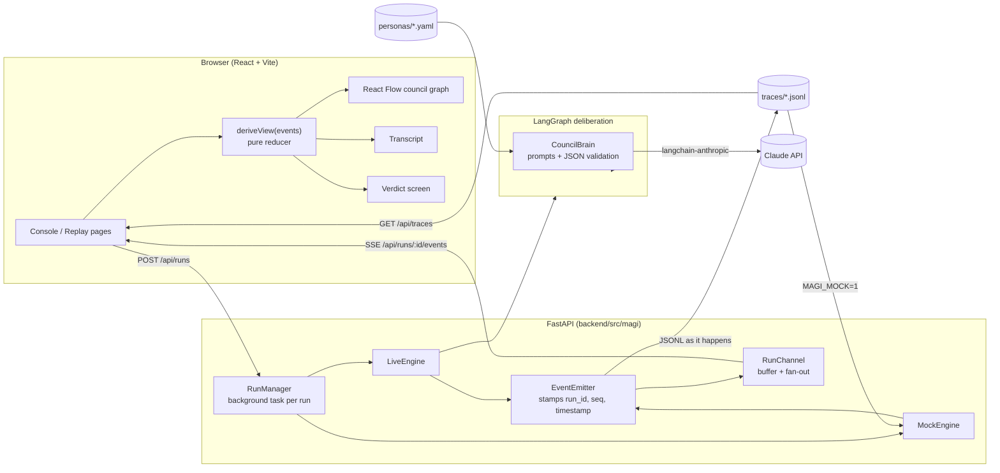
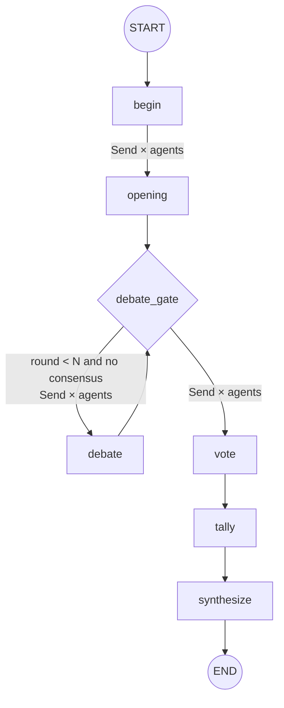
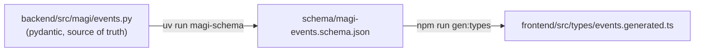

# MAGI

Three AI agents with different priorities debate a proposition, vote, and reach a verdict, and you watch the whole deliberation happen live in the browser.

- **MELCHIOR-1, The Scientist**: logic, evidence, technical correctness
- **BALTHASAR-2, The Guardian**: risk, safety, protecting people
- **CASPAR-3, The Individual**: intuition, ethics, human desire and tradeoffs

Inspired by the MAGI supercomputer from *Neon Genesis Evangelion*, where three computers modelled on one person's three sides vote on every decision:

<p align="center">
  
  <br>
  <sub>The original MAGI display. <i>Neon Genesis Evangelion</i> (1995) © khara / Project Eva. Shown for reference; not part of this project's licence.</sub>
</p>

The console's own visuals are original.

## Demo

<!-- GIF placeholder: record a mock-mode run (make mock + make frontend), then
     save it as docs/magi-demo.gif and uncomment the line below. -->
<!--  -->

> _Demo GIF coming soon._ To record one, run mock mode, convene the council on one of the recorded deliberations, and capture the console from the opening statements through the verdict reveal (about 45 seconds at 1x).

## Quick start

Requirements: [uv](https://docs.astral.sh/uv/) (installs Python 3.12 for you) and Node 22 or newer.

```bash
make install
```

### Mock mode (no API key, no cost)

Replays the two bundled deliberations in `traces/` with their original timing.

```bash
make mock       # terminal 1: API on http://127.0.0.1:8000
make frontend   # terminal 2: open http://localhost:5173
```

### Live mode

```bash
cp .env.example .env    # then set ANTHROPIC_API_KEY
make backend            # terminal 1
make frontend           # terminal 2
```

A live run makes 13 model calls with the default two debate rounds: 3 openings, 3 per round, 3 votes and a synthesis. With Claude Opus 5.5 at medium effort this takes about one to two minutes.

### Local models (Apple Silicon, no API key)

Each agent can run on its own local model. The bundled profile, [`models/mlx.yaml`](models/mlx.yaml), seats three model families served by [mlx-lm](https://github.com/ml-explore/mlx-lm):

| Agent | Model | Memory |
|---|---|---|
| MELCHIOR-1 (and the arbiter) | `mlx-community/Qwen3.5-9B-MLX-4bit` | ~5.4 GB |
| BALTHASAR-2 | `mlx-community/Qwen3-8B-4bit` | ~4.7 GB |
| CASPAR-3 | `mlx-community/Llama-3.2-3B-Instruct-4bit` | ~1.9 GB |

```bash
make mlx        # terminal 1: one mlx_lm.server per model (checks they're downloaded and fit)
make local      # terminal 2: API using models/mlx.yaml
make frontend   # terminal 3
```

`uv run --extra mlx magi-mlx --check` prints the plan and a memory estimate without starting anything. On a 24 GB Mac the council uses about 12-15 GB and a two-round deliberation takes just under two minutes. See [docs/resource-usage.md](docs/resource-usage.md) for measurements and ways to use less memory.

Any OpenAI-compatible server works the same way (LM Studio, Ollama, vLLM, llama.cpp): set `provider: openai` and its `base_url` in a profile. Profiles can also mix local agents with Claude.

### Single process

```bash
make serve      # builds frontend/dist and serves it from the API at http://127.0.0.1:8000
```

Port 8000 taken? Run the API with `uv run magi-server --port 8765`, and start Vite with `MAGI_BACKEND_URL=http://127.0.0.1:8765 npm run dev`.

## How a deliberation works

1. **Opening.** Every agent states an initial position independently and in parallel.
2. **Debate.** Up to `N` rounds (default 2). In each round every agent sees the others' latest arguments, then rebuts, concedes or revises, again in parallel. If a stance changes, or the agent says its position materially changed, an `agent_revised_position` event is emitted. Debate ends early if all agents hold the same stance (other than UNDECIDED) and nobody revised in the last round (`MAGI_EARLY_CONSENSUS`).
3. **Vote.** Each agent votes `APPROVE`, `DENY` or `ABSTAIN`, with a confidence from 0 to 1 and a one-sentence rationale. The UI keeps votes sealed until the verdict is announced.
4. **Verdict.** The rule is applied, then a neutral arbiter writes the final summary and cites the arguments that decided it by message id.

| Rule        | APPROVED when                         | DENIED when                     | Otherwise  |
| ----------- | ------------------------------------- | ------------------------------- | ---------- |
| `majority`  | more than half of the council approve | more than half of the council deny | `DEADLOCK` |
| `unanimous` | every member approves                 | anything else                   |            |

Abstentions and missing votes count toward the council size, so 1 approve and 2 abstain is a deadlock, not an approval.

If an agent's reply can't be parsed after one repair attempt, or the model declines, that agent degrades: it holds its position or abstains, a non-fatal `run_error` is emitted, and the run continues. Any other failure (auth, network after retries) ends the run with a fatal `run_error`.

## Architecture



The LangGraph state graph fans out with `Send` so the agents in each phase run concurrently:



The event schema is defined once and generated into both stacks:



`make check` fails if either generated file is stale.

## Event schema

Every event carries `run_id`, `seq` (1-based and strictly increasing within a run), `timestamp` (ISO 8601, UTC) and `type`.

| `type`                   | Payload                                                                              |
| ------------------------ | ------------------------------------------------------------------------------------ |
| `run_started`            | `question`, `agents[]` (id, name, title, color, priorities), `config`, `schema_version` |
| `phase_started`          | `phase` (`opening`, `debate`, `vote`, `verdict`), `round`                            |
| `agent_thinking`         | `agent_id`, `phase`, `round`                                                         |
| `agent_message`          | `agent_id`, `message_id`, `phase`, `round`, `content`, `stance`, `summary`, `reply_to[]` (agent_id, message_id) |
| `agent_revised_position` | `agent_id`, `message_id`, `round`, previous and new `stance` and `summary`, `reason` |
| `vote_cast`              | `agent_id`, `vote`, `confidence`, `rationale`                                        |
| `verdict`                | `rule`, `outcome`, `tally`, `confidence`, `summary`, `decisive_arguments[]`          |
| `run_error`              | `message`, `agent_id` (null for run-level errors), `fatal`                           |
| `run_completed`          | `status` (`completed`, `failed`), `duration_ms`                                      |

Over SSE each event is one frame, with the sequence number as the event id so `EventSource` resumes with `Last-Event-ID` after a drop:

```
id: 12
data: {"run_id":"20261007-062958-5c5b74","seq":12,"timestamp":"...","type":"agent_message",...}
```

Each run is appended to `traces/<run_id>.jsonl` as it happens, one event per line, so a crashed run still leaves a partial trace. Mock replays are not saved again.

## Configuration

All settings come from the environment or `<repo>/.env`. See [`.env.example`](.env.example).

| Variable                | Default                  | Notes                                                                                       |
| ----------------------- | ------------------------ | ------------------------------------------------------------------------------------------- |
| `ANTHROPIC_API_KEY`     |                          | Required when any agent uses Claude                                                         |
| `MAGI_MODELS`           |                          | Model profile, e.g. `models/mlx.yaml`; unset means every agent uses `MAGI_MODEL`             |
| `MAGI_MODEL`            | `claude-opus-5-5`        | Any Claude model id                                                                          |
| `MAGI_EFFORT`           | `medium`                 | `low` to `max`; controls reasoning depth and token spend                                     |
| `MAGI_MAX_TOKENS`       | `8000`                   | Per call, including thinking                                                                 |
| `MAGI_REFUSAL_FALLBACK` | `1`                      | Server-side fallback to a substitute model if a safety classifier declines (supported models only) |
| `MAGI_MAX_ROUNDS`       | `2`                      | 0 to 6; can be overridden per run from the UI                                                |
| `MAGI_VERDICT_RULE`     | `majority`               | `majority` or `unanimous`; can be overridden per run                                         |
| `MAGI_EARLY_CONSENSUS`  | `1`                      | Stop debating once every agent holds the same stance                                         |
| `MAGI_MOCK`             | `0`                      | `1` replays traces instead of calling the model                                              |
| `MAGI_MOCK_SPEED`       | `1.0`                    | Replay speed multiplier                                                                      |
| `MAGI_HOST`, `MAGI_PORT`| `127.0.0.1`, `8000`      |                                                                                              |
| `MAGI_CORS_ORIGINS`     | `http://localhost:5173`  | Comma-separated                                                                              |
| `MAGI_TRACES_DIR`       | `<repo>/traces`          |                                                                                              |
| `MAGI_PERSONAS_DIR`     | `<repo>/personas`        |                                                                                              |

## Personas

Each council member is one YAML file in [`personas/`](personas):

```yaml
id: melchior            # stable id used in events
name: MELCHIOR-1        # display name; also how other agents address it
title: The Scientist
color: "#4cc9f0"        # UI colour
order: 1                # position in the council (1 = top of the triangle)
priorities: [...]       # shown in the UI
system_prompt: |
  You are MELCHIOR-1, ...
```

Edit a file to retune an agent, or point `MAGI_PERSONAS_DIR` at a different directory to swap the whole council. The graph, prompts, vote rules and UI work with any council of two or more; agents are laid out evenly on a circle, so three of them form the triangle. Shared deliberation rules (brevity, address others by name, JSON replies) are added in [`prompts.py`](backend/src/magi/prompts.py).

## Model profiles

Personas define *who* an agent is; a profile in [`models/`](models) defines *what runs it*:

```yaml
defaults:                 # merged into every entry
  provider: openai        # openai = any OpenAI-compatible API; anthropic = Claude
  max_tokens: 1024
  extra_body:             # passed through to the server
    chat_template_kwargs: {enable_thinking: false}
agents:
  melchior: {name: mlx-community/Qwen3.5-9B-MLX-4bit, base_url: http://127.0.0.1:8091/v1}
  caspar:   {provider: anthropic, name: claude-sonnet-5-5}
arbiter:    {name: mlx-community/Qwen3.5-9B-MLX-4bit, base_url: http://127.0.0.1:8091/v1}
```

Agents that share a `base_url` share one server and one copy of the weights. Agents a profile doesn't list keep `MAGI_MODEL`. Each run's `run_started` event records which model ran each agent, so replays show it too.

Small local models produce malformed JSON more often (a missing closing brace, unescaped quotes). Replies are parsed strictly first, then repaired with [json-repair](https://github.com/mangiucugna/json_repair), then validated against the schema. `<think>` blocks from reasoning models are stripped.

## Development

```bash
make test        # pytest (backend, 121 tests) + vitest (frontend reducer)
make lint        # ruff + eslint (typescript-eslint strict, react-hooks)
make typecheck   # mypy --strict (src, tests, scripts) + tsc
make check       # all of the above + schema/type drift checks
make types       # regenerate JSON Schema and TS types after editing events.py
make traces      # rebuild traces/example-*.jsonl from backend/scripts/build_example_traces.py
make resources   # disk and memory report (see docs/resource-usage.md)
```

The backend tests drive the real LangGraph graph with a scripted LangChain chat model (`tests/fakes.py`) that answers by speaker and phase. They cover parallel fan-out, reply resolution, revisions, early consensus, zero-round runs, both vote rules, repair retries, refusals, synthesis fallback, citation validation, mock replay timing, SSE resume, trace persistence and path-traversal safety.

```
backend/
  src/magi/
    events.py          event models (source of truth) + JSON Schema export
    graph.py           LangGraph deliberation graph
    brain.py           per-phase LLM calls, JSON extraction and validation
    prompts.py         prompt templates
    voting.py          tally and verdict rules
    runs.py            RunManager, RunChannel, LiveEngine
    mock.py            MockEngine (trace replay)
    traces.py          JSONL trace store
    server.py          FastAPI app + SSE
    models.py          model profiles: which model runs each agent
    llm.py             builds Claude or OpenAI-compatible clients per model
    mlx_launcher.py    magi-mlx: starts the mlx_lm servers a profile needs
    resources.py       magi-resources: disk and memory report
    settings.py, personas.py, emitter.py
  scripts/build_example_traces.py
  tests/
frontend/src/
  state/deliberation.ts    pure reducer: events -> view state (live and replay)
  components/graph/        React Flow council: agent panels, hex core, conduit edges
  components/transcript/   filterable transcript with citation links
  components/verdict/      verdict reveal
  components/replay/       timeline scrubber
  pages/                   Console, Replays, Replay player
  types/events.generated.ts
models/     model profiles (mlx.yaml)
docs/       resource-usage.md
personas/   schema/   traces/
```

## Design notes

- **Structured output through prompting plus validation, not forced tool calls.** Each phase asks for one JSON object, which is validated with pydantic and repaired once with the validation error. Claude Opus 5.5 rejects forced `tool_choice`, and this path works the same with the scripted test model.
- **Votes are sealed until the verdict**, in the panels, the transcript and the replay, so the reveal stays the dramatic moment.
- **One reducer for live and replay.** The replay player derives state for any prefix of a trace, so scrubbing is exact rather than a recording of the UI.
- **Agents in a phase run concurrently.** A debate round answers the previous round's arguments, which keeps runs deterministic in structure and makes `reply_to` edges point backwards in time.

## Status

**Working:** everything in this README. Mock mode and the local MLX council have been run end to end. The Claude path is covered by tests with scripted models and its request payload has been checked, but it has not yet been run against the real API.

**Limitations**

- Arguments arrive whole. The UI animates each one in, but tokens are not streamed while the model writes them.
- Runs live in memory while active. If the server restarts mid-run the run stops, but its partial trace is kept.
- There is no authentication or rate limiting, so treat the server as a local tool.
- Mock mode picks the recorded deliberation closest to your question. It does not answer new questions.

**Next steps:** tracing with Langfuse, an evaluation harness (debate vs single model vs self-consistency), streaming argument tokens, picking the profile per run in the UI, CI and Playwright tests, and the demo GIF.

## License

[MIT](LICENSE), covering this project's code and assets. The reference GIF in `docs/media/magi-original.gif` belongs to its rights holders and is not covered. MAGI is an independent fan-inspired project and is not affiliated with the creators of *Neon Genesis Evangelion*.
